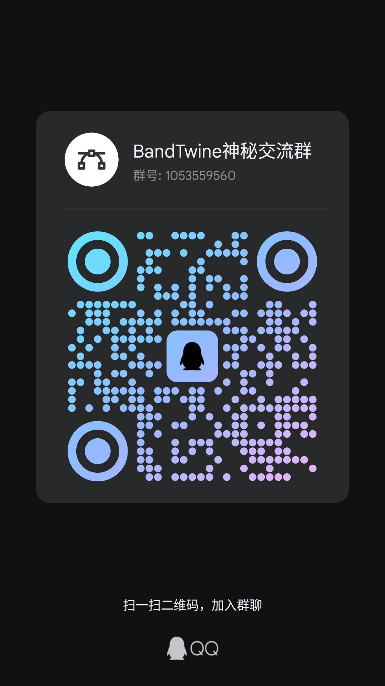

# 欢迎来到 BandTwine 社区

这里是所有 BandTwine 创作者、开发者和爱好者的聚集地。无论你是刚刚踏上互动叙事之旅的新手，还是经验丰富、希望为项目添砖加瓦的开发者，我们都张开双臂欢迎你的加入！

我们相信，一个开放、互助的社区是项目持续发展的基石。在这里，你可以：

*   **寻求帮助**: 遇到难题时，向社区和开发者提问。
*   **分享作品**: 展示你的创意和故事，获得反馈和赞赏。
*   **交流技巧**: 与其他创作者分享你的 `data.json` 编写心得和叙事技巧。
*   **贡献力量**: 报告 Bug、提出建议，甚至直接贡献代码，让 BandTwine 变得更好。

##  💬 QQ 交流群

这是我们最活跃的社区，推荐所有用户加入！

*   **群号**: **1053559560**

在这里，你可以：
*   与开发者和其他创作者**实时交流**。
*   获得免费的**技术指导**和创作支持。
*   第一时间获取引擎的**最新动态**和测试版本。
*   分享你的灵感和作品截图。

  

---

##  💻 GitHub 互动

GitHub 是我们项目协作和问题追踪的官方平台。

*   **[报告 Bug](https://github.com/OrPudding/VelaOS_BandTwine/issues/new?assignees=&labels=bug&template=bug_report.md&title= )**: 如果你发现引擎运行不符合预期，或者遇到了崩溃等问题，请通过 Issue 告诉我们。清晰的描述和复现步骤将极大地帮助我们定位问题。

*   **[提出新特性建议](https://github.com/OrPudding/VelaOS_BandTwine/issues/new?assignees=&labels=enhancement&template=feature_request.md&title= )**: 你有什么绝妙的点子，希望 BandTwine 增加什么新功能吗？我们非常乐意倾听！

*   **[贡献代码](https://github.com/OrPudding/VelaOS_BandTwine/pulls )**: 如果你是一位开发者，并且希望为 BandTwine 贡献代码，我们无比欢迎！请先 Fork 项目，然后在你的分支上进行修改，最后提交 Pull Request。

*   **点亮 Star ⭐**: 如果你喜欢 BandTwine，别忘了在 GitHub 仓库主页为我们点亮一颗 ⭐ Star！这是对我们最大的认可和鼓励。

---

##  ❓ FAQ (常见问题解答)

在提问之前，不妨先在这里看一看，也许你的问题已经有了答案。

> **Q1: 我的链接为什么没有显示在屏幕上？**
> **A1:** 这是最常见的问题！请检查你是否在节点的 `"text"` 属性中，使用了 `{0}`, `{1}`... 这样的标记来引用 `"links"` 数组中对应索引的链接。这是 BandTwine 的核心规则，**必须标记才能显示**。
> 
> **Q2: 我的链接显示了，但为什么是灰色的，无法点击？**
> **A2:** 这通常是因为链接的 `"condition"` 条件没有满足。请检查条件表达式是否正确，以及相关的变量值是否符合预期。
>
> **Q3: 我可以在哪里找到所有动作、条件和标记的详细用法？**
> **A3:** 请查阅我们的 **[深度指南](/guides)** 和 **[API 参考](/api-reference)**，那里有最详尽的说明和示例。

> 我们会根据社区的提问，持续更新这份 FAQ 列表。

---

## 感谢名单

### 我们衷心感谢以下人员对 BandTwine 项目的贡献和支持：

**开发者**:
- OrPudding (项目发起人 维护者)
  
**贡献者**:
  - Waijade (文档镜像 verify页面)

**捐赠者(不分先后)**:
- 牛蛙
- 丛雨头像那个

**社区支持**:
- 所有在 QQ 群和 GitHub 上积极参与讨论的用户
 - 提交 Bug 报告和功能建议的用户

---
### 感谢每一位为 BandTwine 项目付出时间和精力的朋友！让我们一起，用代码和文字，在智能穿戴的方寸屏幕上，构建一个又一个精彩纷呈的世界！
